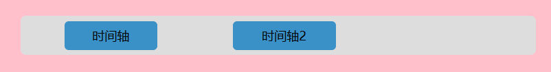

# vuetimeaxisdemo

## 下载
```shell
npm i vuetimeaxisdemo
```

## 使用

`main.js`

```js
import vueTimeAxisDemo from 'vuetimeaxisdemo'
import  'vuetimeaxisdemo/vueTimeAxisDemo.css'
Vue.use(vueTimeAxisDemo);
```

`App.vue`

```vue
<template>
  <div id="app">
    <vueTimeAxis :option="option" />
  </div>
</template>

<script>
export default {
  name: "App",
  data() {
    return {
      option: {
        id:'0',
        width: 500,
        min: 0,
        max: 100,
        data: [
          {
            id: "1",
            text: "时间轴",
            start: 2,
            end: 20,
          },
          {
            id: "2",
            text: "时间轴2",
            start:30,
            end: 50,
          },
        ],
      },
    };
  },
};
</script>

<style>
#app {
  width: 600px;
  height: 300px;
  background-color: pink;
  margin: 0 auto;
  padding: 24px;
  overflow: auto;
}
</style>
```


可以拖动蓝色块进行调整，并实时更新`start`和`end`属性